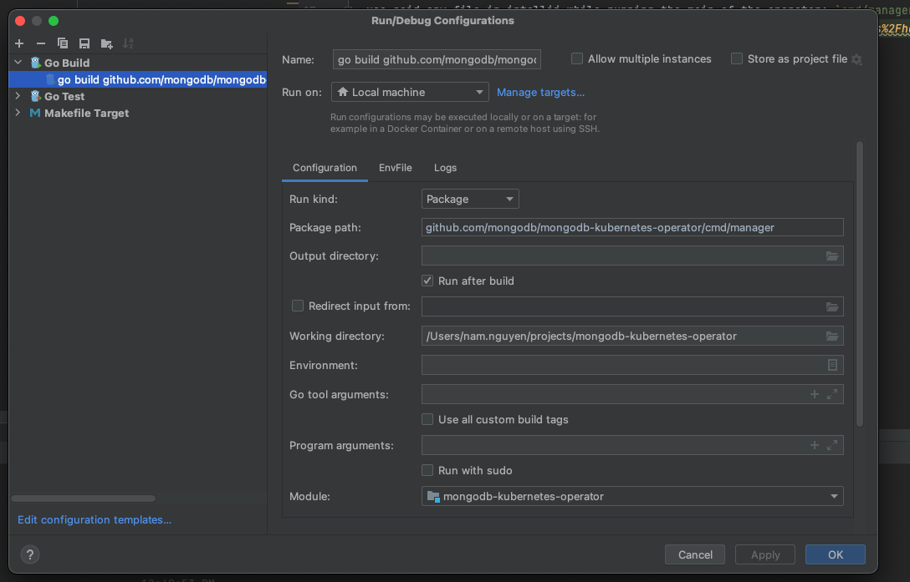
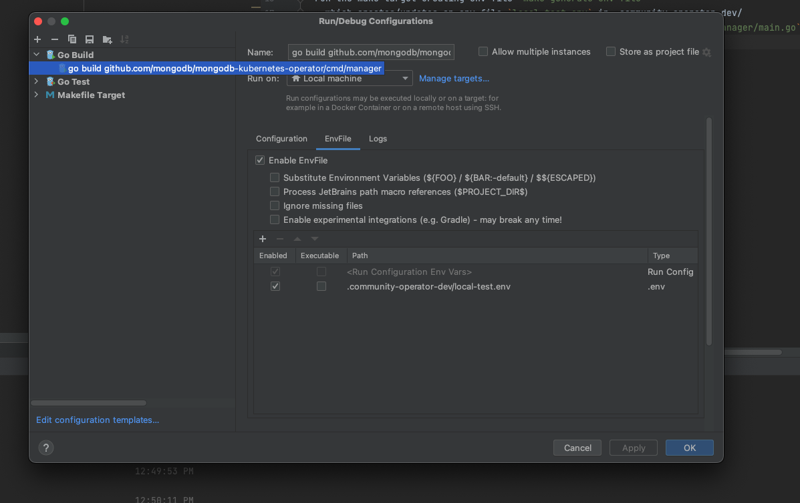

# Quick start for building and running the operator locally

This document contains a quickstart guide to build and running (+debugging) the operator locally.
Being able to run and build the binary locally can help with faster feedback-cycles.

## Prerequisites
- Follow the general setup to be able to run e2e tests locally with our suite as described here, which includes the usage of [telepresence](https://www.getambassador.io/docs/telepresence/latest/quick-start/):
  - [contributing.md](contributing.md)
  - [build_operator_locally.md](build_operator_locally.md)
  - If above has been configured there should be either:
    - `$HOME/.kube/config`
    - `KUBECONFIG` environment variable pointing at a file
    - **Note**: either of these are necessary to be able to run the operator locally
- Have a folder `.community-operator-dev`
## Goals
- Run the operator locally as a binary (optionally in debug mode) in command line or in an IDE
- Run e2e tests locally

## Running The Operator locally - IntelliJ
1. Below steps rely on the use of the [EnvFile](https://plugins.jetbrains.com/plugin/7861-envfile) plugin which enables loading `.env` files in `run configurations`
2. Run the make target creating env file `make generate-env-file`, which creates/updates an env file `local-test.env` in .community-operator-dev/
3. Use local-test.env file in IntelliJ while running the main of the operator: `cmd/manager/main.go`




## Running The Operator locally - Shell
1. Use the dedicated make target which exports the needed environment variables and builds & runs the operator binary

```sh
make run 
```

2.  For debugging one can use the following make target, which uses [dlv](https://github.com/go-delve/delve):

```sh
make debug
```

## Running e2e tests with the local operator
- Our [e2e tests](../test/e2e), contains sub-steps that will install the following helm-chart: [operator.yaml](../helm-charts/charts/community-operator/templates/operator.yaml)
- By default, the template chart sets the number of operator replicas to `1`. This will clash with our local running operator. With this in mind the solution is to set the replicas number to `0` temporarily.
- Follow the guide on how to run `e2e` tests as described in our [contributing.md](contributing.md), for instance:

```sh
make e2e-telepresence test=<test-name>
```
